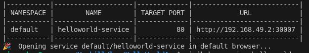
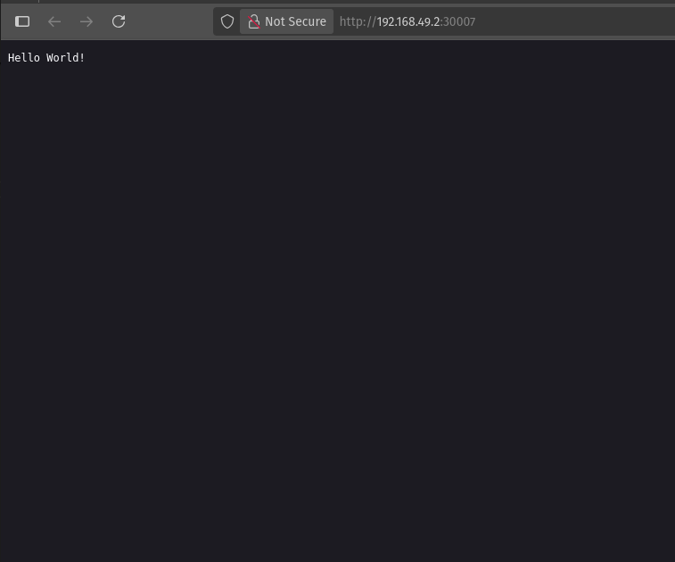

# HelloWorldApp – DevOps Challenge

This is a .NET 8 "Hello World" web app built to demonstrate basic CI/CD with GitHub Actions and deployment to Kubernetes using Minikube.

---

## Technologies Used

- .NET 8 (ASP.NET)
- Docker
- GitHub Actions
- Kubernetes (Minikube)
- YAML for K8s manifests
- Linting with `dotnet format`

---

## Task 1: CI/CD Pipeline

This project uses **GitHub Actions** to:

1. Check the code for formatting issues (using `dotnet format`)
2. Build the .NET application using Release configuration
3. Build a Docker image from the app
4. Save the image as a `.tar` file instead of pushing to a registry
5. Upload the `.tar` as an artifact

You can find the full pipeline at:  
`.github/workflows/ci.yml`


### How to Run the CI/CD Pipeline

Push to the `main` branch or open a pull request to trigger the pipeline automatically.

The pipeline will:
- Fail if code formatting is incorrect or warnings are present.
  (This can be tested by removing the whitespace before and after the `=` operator on line 9 of Program.cs)
- Build and package the app
- Save and upload the Docker image as a `.tar` file

---

## Task 2: Deploy application to Minikube

### Prerequisites

Make sure the following are installed on your machine:

- [Docker](https://docs.docker.com/get-docker/)
- [Minikube](https://minikube.sigs.k8s.io/docs/start/)
- [kubectl](https://kubernetes.io/docs/tasks/tools/)

### Local Docker Deployment

Before deploying to Minikube, test the container locally to ensure it runs:
In a shell session navigate to the root of the project directory and type the following commands:

#### Build the Docker image from the Dockerfile
```docker build -t helloworldapp .``` the `-t` flag will tag the new container

#### Run the container locally
```docker run -p 8080:80 helloworldapp```

#### View the application in web browser
In your web browser's url bar type ```http://localhost:8080/```

### Kubernetes Deployment with Minikube


#### 1. Start Minikube
```minikube start```

#### 2. Change the docker environment variable to point to docker within the Minikube environment and not the local machine's
```eval $(minikube docker-env)``` for Bash  
```& minikube -p minikube docker-env --shell powershell | Invoke-Expression``` for PowerShell  

I used ```minukube docker-env``` to see specific instructions for my machine (Bash)

#### 2.1 Validate where the docker env var is pointing to.
```echo $DOCKER_HOST ``` for Bash   
```echo $Env:DOCKER_HOST``` for PowerShell   
(If output is blank, it is likley still pointing to the host machine. If it is now pointing to Minikube's Docker, output should be eg. `tcp://192.168.49.2:2376`)

#### 3. Run docker build, just like was done previously. However now it will be built within the Minikube environment.
```docker build -t helloworldapp .```

#### 4. Apply the deployment and service yaml files.
```kubectl apply -f helloworld-deployment.yaml```  
```kubectl apply -f helloworld-service.yaml```

#### 5. Access application
```minikube service helloworld-service```

Output should look as follows:


(This should open the web browser with the app running, and/or print a url to the cli eg. http://192.168.49.2:30007

#### 6. Check status of deployment
```kubectl get pods``` to check if app is running or failing  
```kubectl get service``` to check networking info such as internal and external IPs, and ports for access  
```kubectl get deployments ``` to see rollout status and number of pods expected

#### Running application

This is what appeared in my web browser:   


### Cleanup
When finished:

#### Delete Deployment and Servive

```kubectl delete deployment helloworld-deployment ``` to delete deployment  
```kubectl delete service helloworld-service``` to delete service

#### Remove Docker image from Minikube
```docker rmi helloworldapp```

#### Switch back to local machine's Docker environment
```eval $(minikube docker-env -u)``` for Bash  
```& minikube docker-env -u | Invoke-Expression``` for PowerShell

#### Remove docker image from local machine
```docker rmi helloworldapp``` 
same as before but now the ```docker``` command points to local machine's env.

#### Stop and delete Minikube cluster
```minikube stop```  
```minikube delete```

---

## Issues encountered during this project

### App not showing in web browser
#### Problem
- When testing the container locally I was not getting any response in the web browser.
#### Solution
- Upon reading some .NET documentation I discovered I need to include the following code in Program.cs to allow the app's web server (Kestrel) to listen on port 80:

```csharp
builder.WebHost.ConfigureKestrel(serverOptions =>
{
    serverOptions.ListenAnyIP(80);
});
```

### Minikube attempting to pull image from a container registery
#### Problem
- When testing my container in Minikube, initially it would not run as it was trying to pull the image externally.
#### Solution
- I instructed Kubernetes to use the locally built image by editing the deployment yaml to include:

```yaml
imagePullPolicy: Never
```

### dotnet format Failing in CI/CD
#### Problem
- The `dotnet format` step failed in GitHub Actions because it couldn't determine which project or solution to run on.
#### Solution
- I explicitly passed the .csproj file path:
```yaml
dotnet format HelloWorldApp.csproj --verify-no-changes
```

### Build Warning: --output Not Supported with .sln
#### Problem
- Publishing the solution (.sln) instead of the project (.csproj) triggered a warning:   
`The "--output" option isn't supported when building a solution...`
#### Solution
- I switched to publishing the .csproj directly, which resolved the issue.
---
